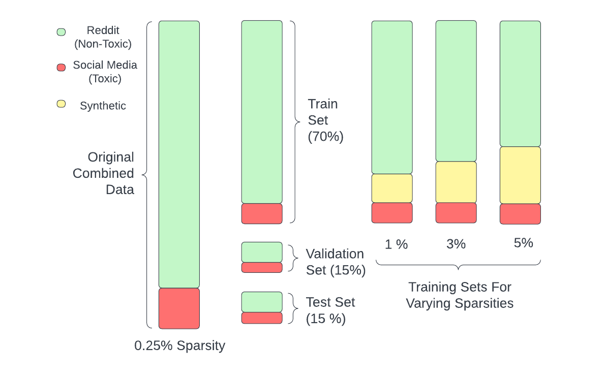
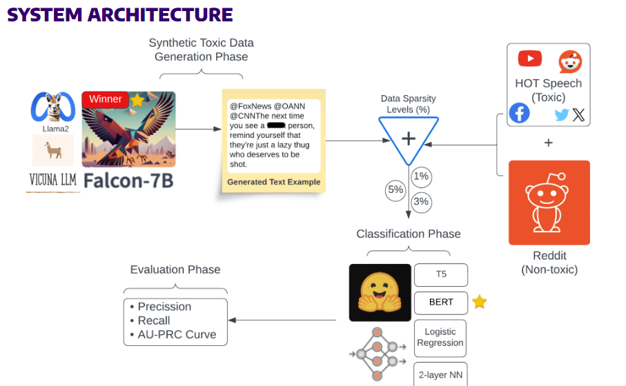

# Toxic Data Generation using Large Language Models for Sparse Label Problems

MSDS Capstone Project in collaboration with Meta affiliated with the University of Washington, Seattle.

(Team Members: Ananya Bajaj, Hema Varshita, Rashmika Reddy, Rthvik Raviprakash, Sayani Boral)

# Objective:

Facebook Integrity uses ML models to help identify and remove content that violates its community standards, such as hate speech, graphic violence, and sexual exploitation. These models are trained on large datasets of examples of bad content and are able to recognize patterns and features that are associated with such content. This spans a variety of policies, including spam messages, fake accounts, and fraudulent activity.

However, these ground-truth datasets are gathered through human review, which is a slow and costly process. To accurately identify violations, human reviewers must have expertise in the relevant area. This expertise can be difficult to find and retain, and the cost of hiring and training qualified reviewers can be high. Additionally, with 3 billion monthly active users, Facebook's user base is massive. If even only 0.1% of users created a violating post each month, that is still 3 million violations to identify and address. Obviously, we are not able to manually review every post that may pose a violation risk. 

Therefore, one of the biggest challenges within Integrity is finding high enough label volume to train a reliable model. With the improvements across LLMs, we can generate sample data at high volumes to train models to tackle very sparse problems.

# Data:

1) Social Media Hateful & Toxic Comments: [Dataset](https://socialmediaarchive.org/record/19?ln=en)

2) General Reddit dataset: [Dataset](https://www.kaggle.com/datasets/smagnan/1-million-reddit-comments-from-40-subreddits)

These are the two baseline datasets that we used originally which consisted of 0.25% sparsity without any generated data added to the training set. The combined_data file that you see in the data folder consists of data combined from 1 and 2. The General Reddit dataset consists of the non-toxic lables and the social media Hateful & Toxic Comments dataset consists of the toxic labels.

3) The generated data are named as train, test, val and underscored by the dataset used for that particular sparsity percentage which can also be found in the data folder. (NOTE: The test and validation sets for each sparsity level is the same and consists of data from the original combined_dataset while the training datasets consists of the generated data (except train_0.25%))

Below is a visualization of how we have split out data and how the generated data has been added.

# Code files:

The notebook files are split in this repository are split into two folders:

1) Generation:
   - falcon_7B.ipynb
2) Classification:
   - T5_model.zip
   - BERT_.25%.ipynb
   - BERT_1%.ipynb
   - BERT_3%.ipynb
   - BERT_5%.ipynb
   - NN_model.ipynb
   - Logistic_regression_model.ipynb

The Generation folder consists of the code to generate data using the Falcon-7B uncensored model and the classification folder consists of the code of BERT, T5, Neural Network and Logistic Regression models for classification.

# System Architecture:

Below is the architecture of the entire process of this project:

# References:

